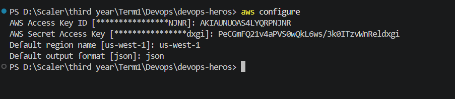
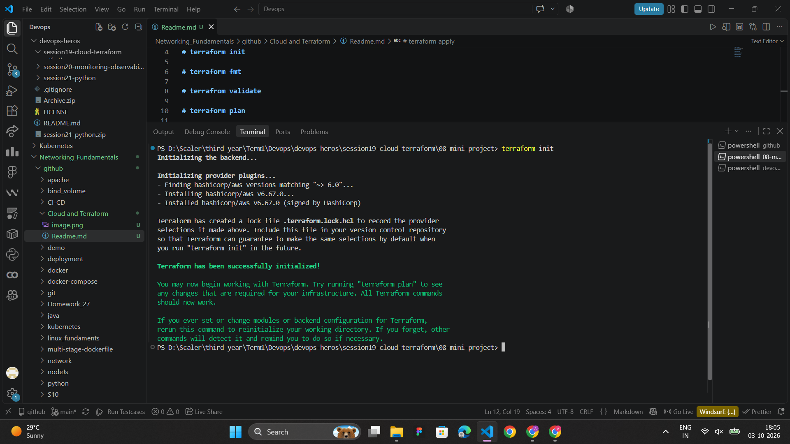
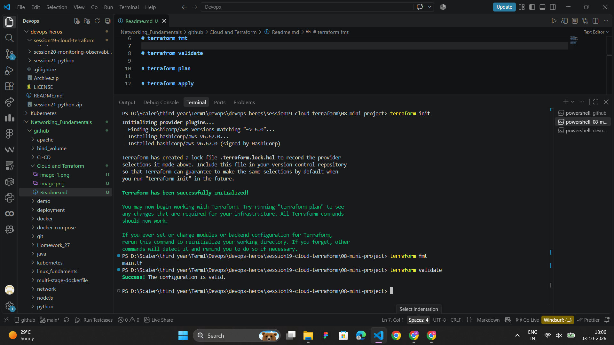
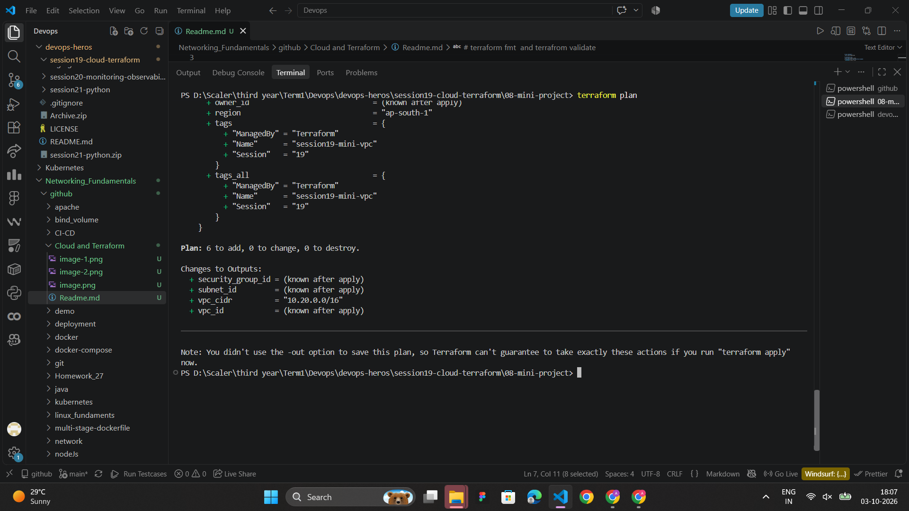
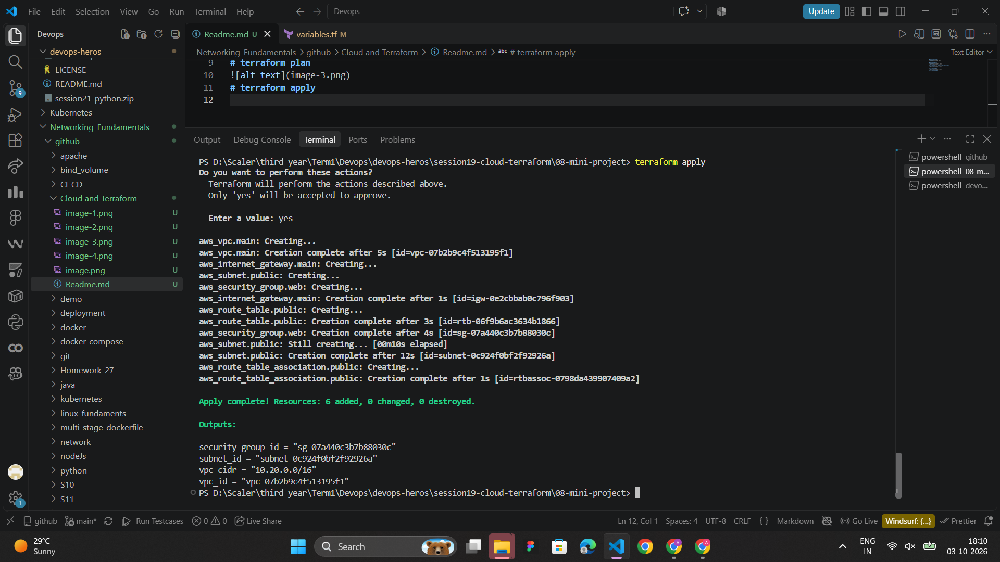
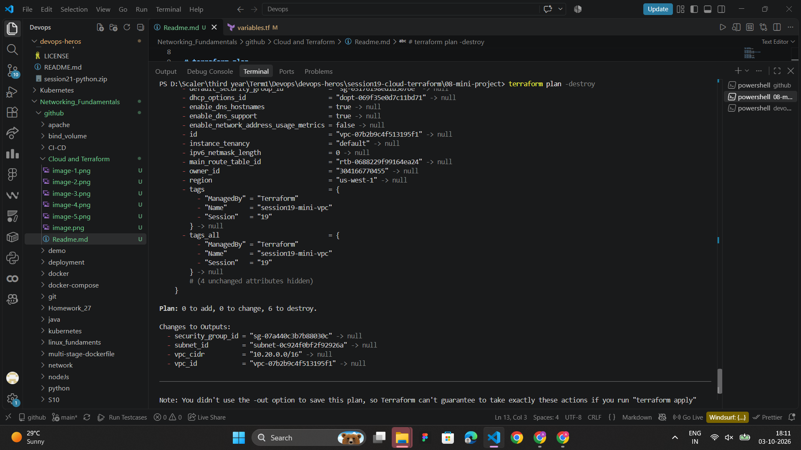
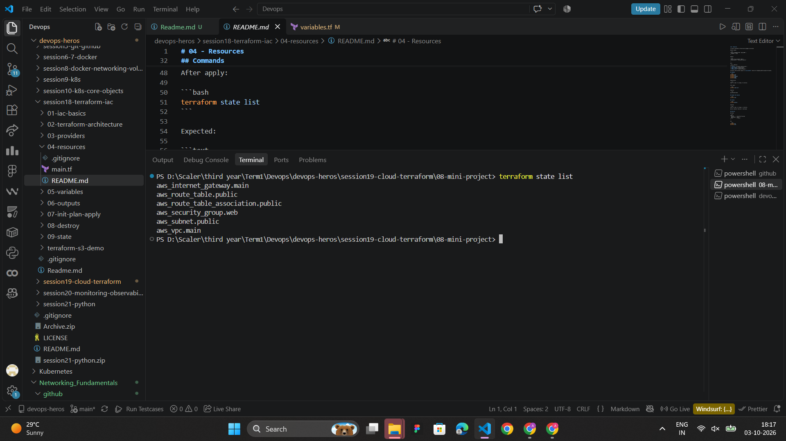
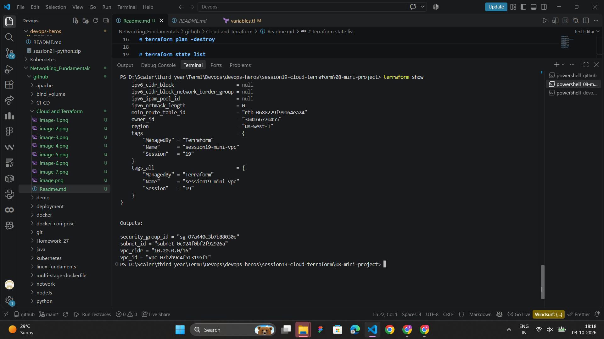
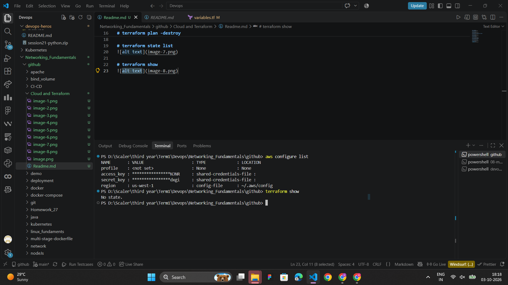
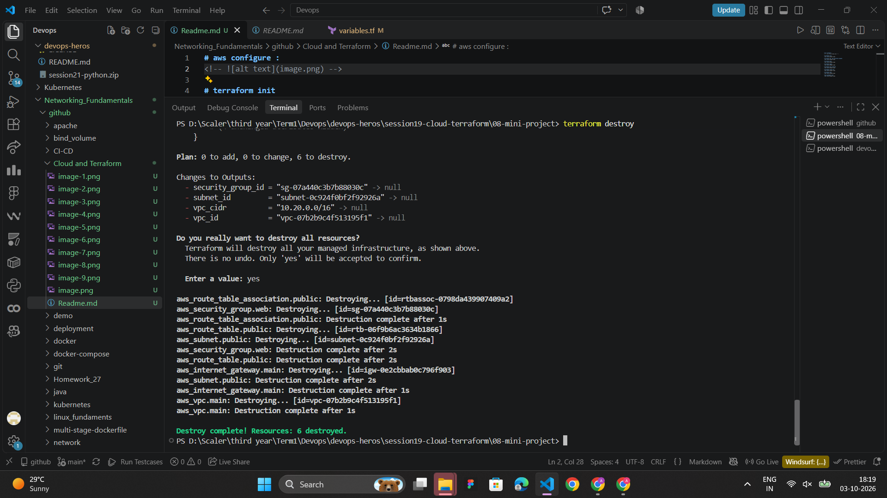

# aws configure :
<!--  -->

# terraform init

# terraform fmt  and terrafrom validate 

# terraform plan 

# terraform apply 

# terraform plan -destroy

# terraform state list 

# terraform show 

# aws configure list 

# terraform destroy 
