# Connecting the networks

## Creating the containers 
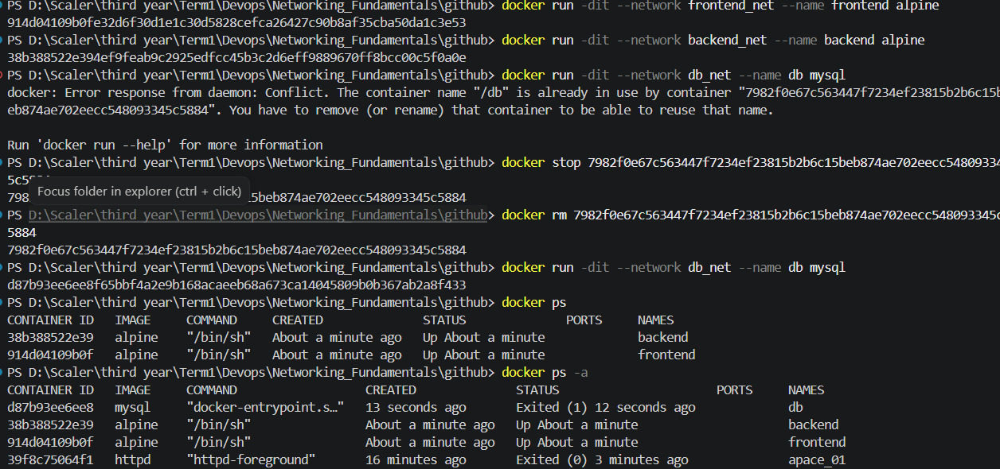

## Inspecting the frontend network
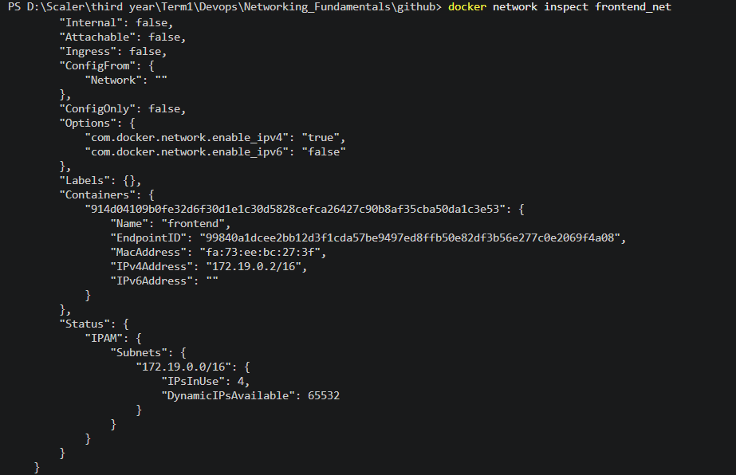
## Inspecting the frontend
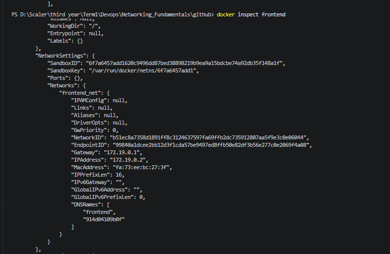

## Inspecting the backend 
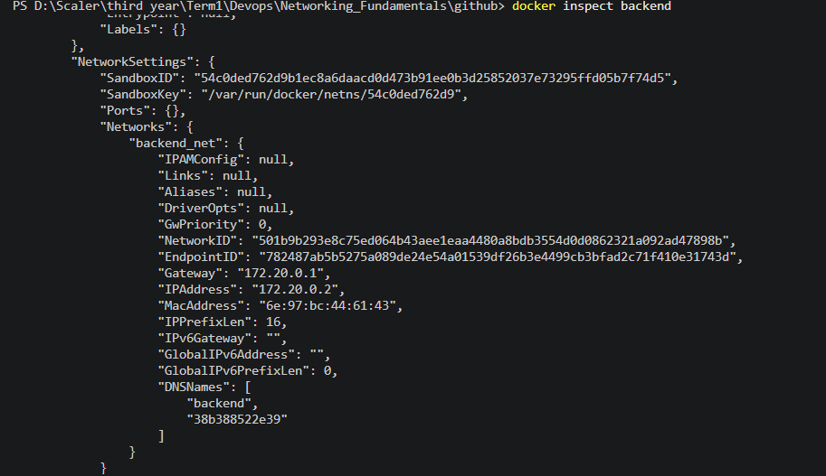

## Inspecting the db
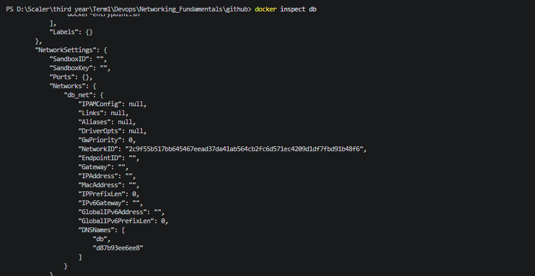

## Connecting db_net to backend conatiner
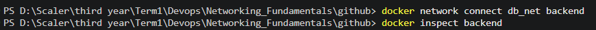
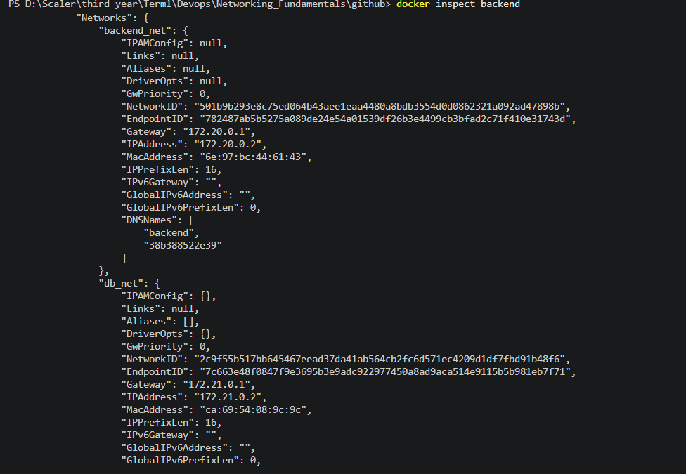

## Connecting frontend_net to backend container
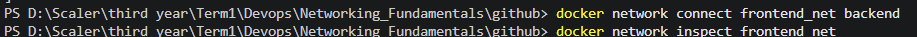
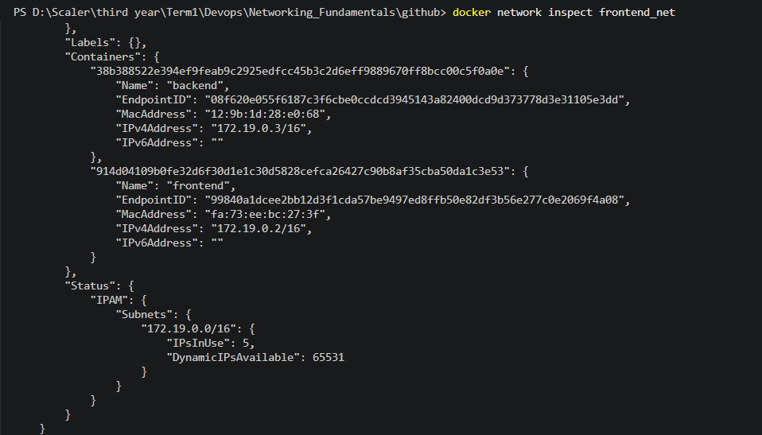

# Apache -> Host

# BIND_VOLUME

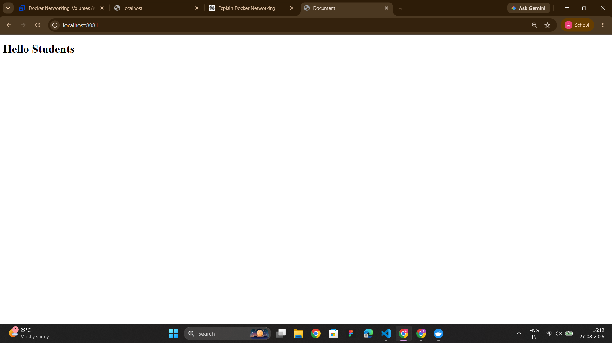
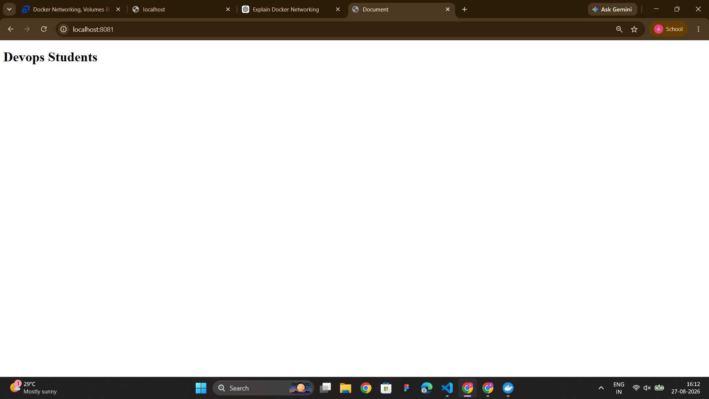
