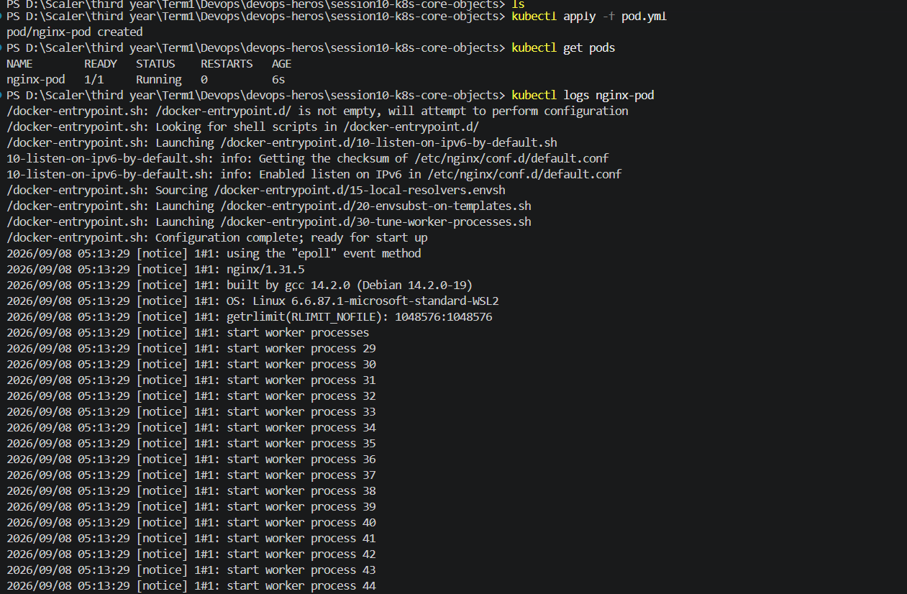
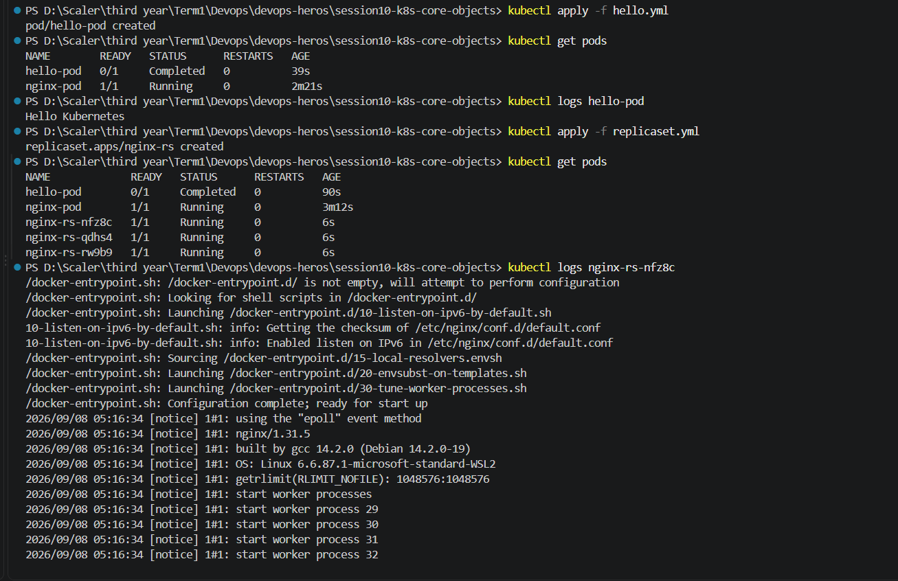
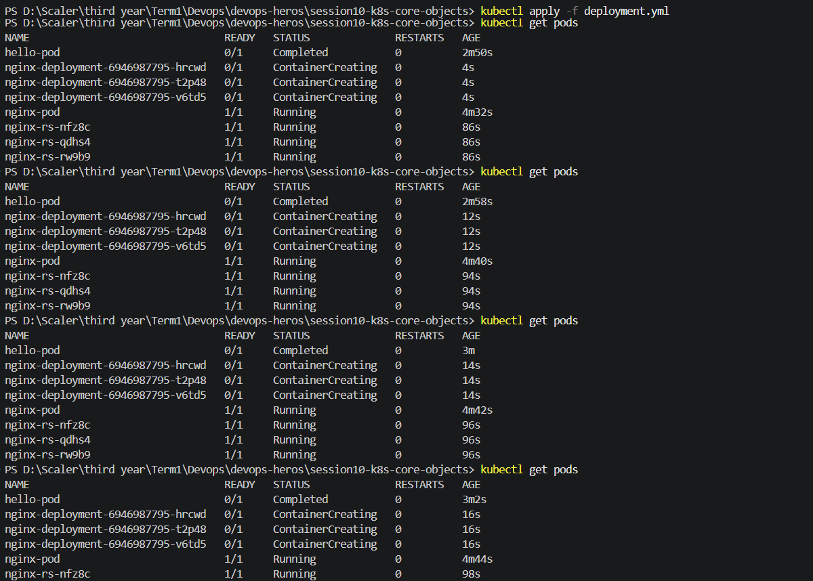
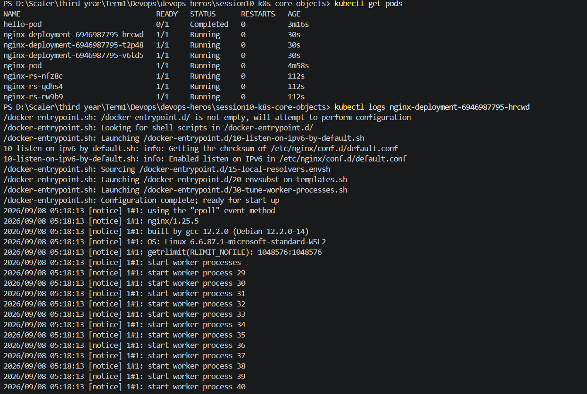
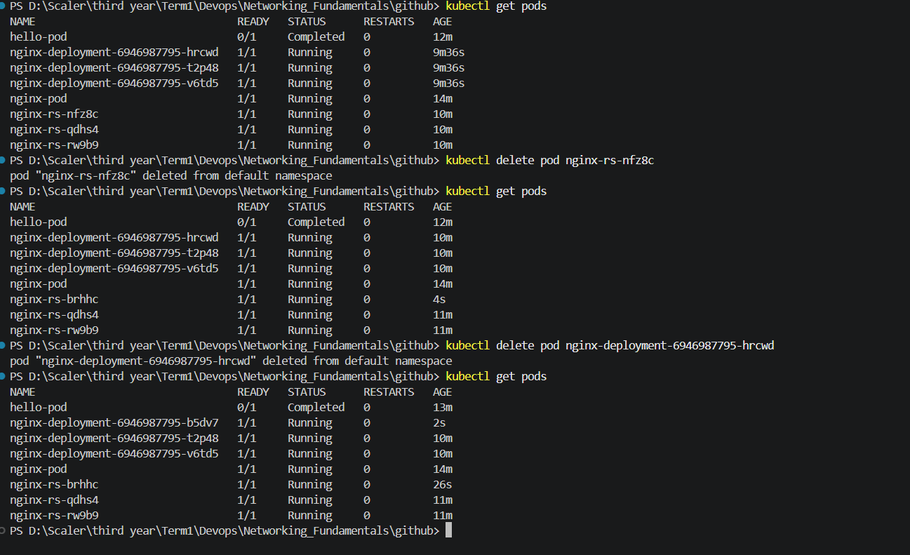
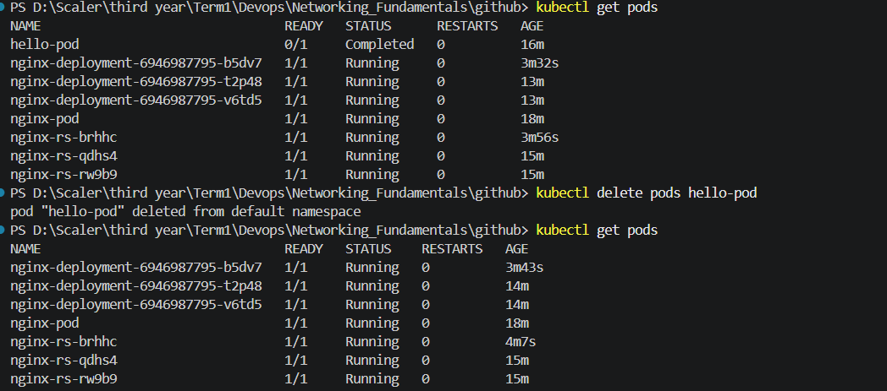
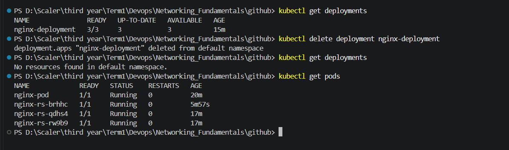
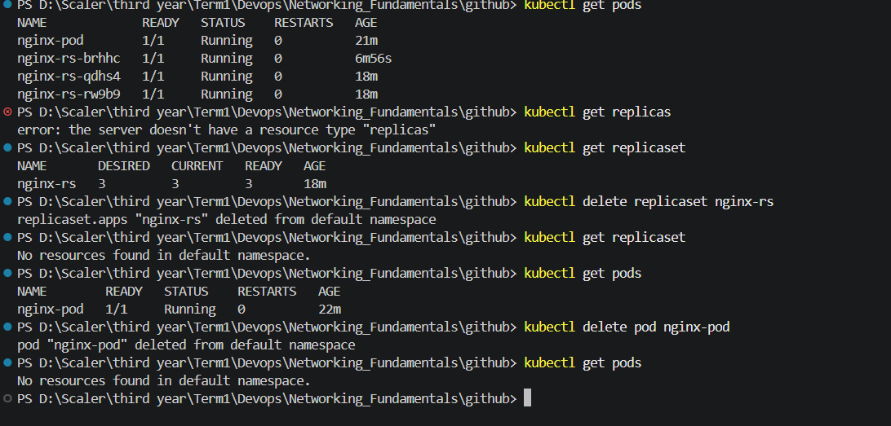

## running and checkiong the status of the pods :

# Pod.yml

# hello.yml & replicaset.yml

# Deployment.yml

# deleting the replica and deployement pod :

## Result when we delete the deploymnt or the replica pod -> the replica controller make a new pod and keep the container running.

# deleting the pod :

# deleting the deployment :

# deleting the replicaset :
