# 01_kubectl_get :

# 02-kubectl-describe :

# 03-kubectl-logs :

# 04-kubectl-exec :

# 05-events :

# 06-crashloopbackoff :

# 07-imagepullbackoff
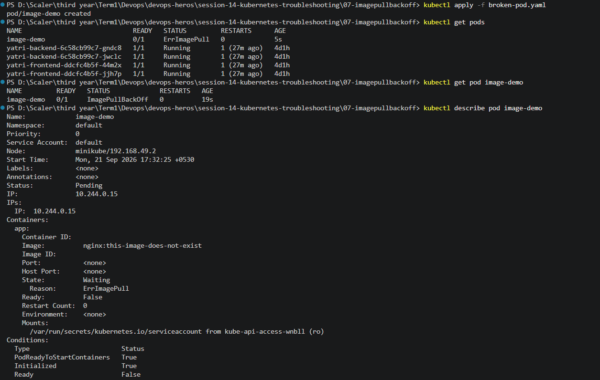
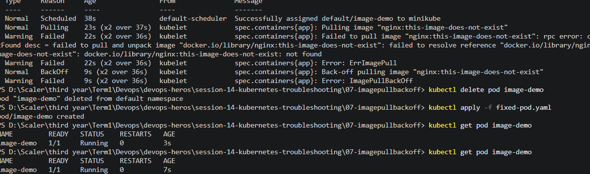
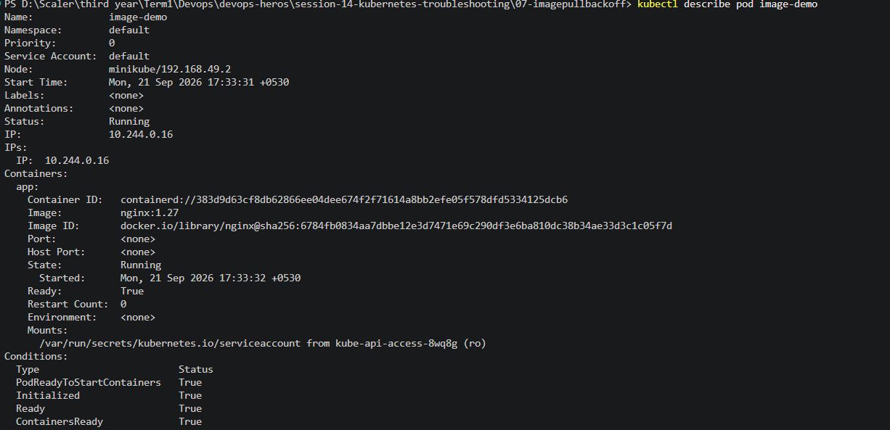
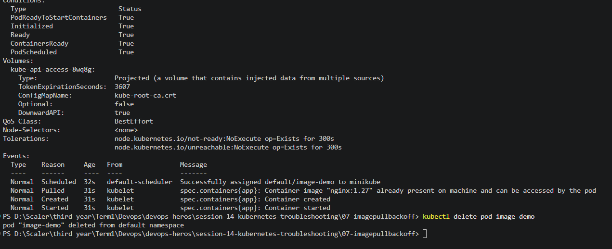

# 08-pending-pods :
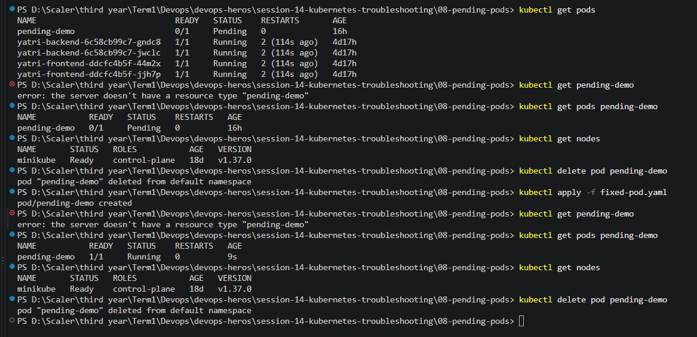

# 09-service-dns-troubleshooting :
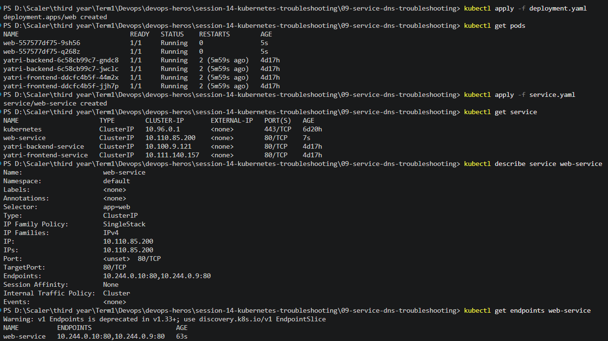           
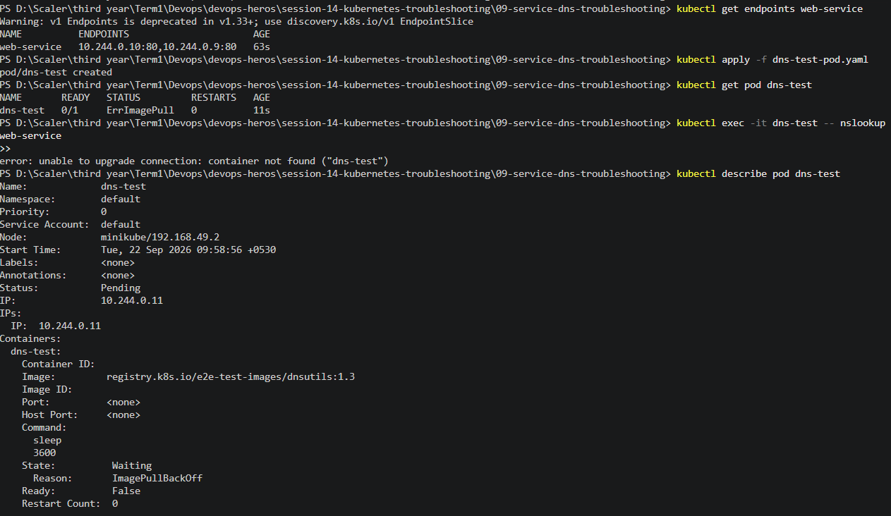       
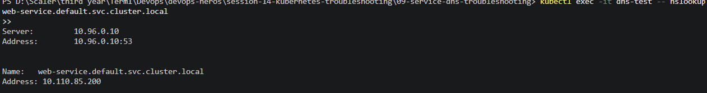                                                       

# Mini Project :
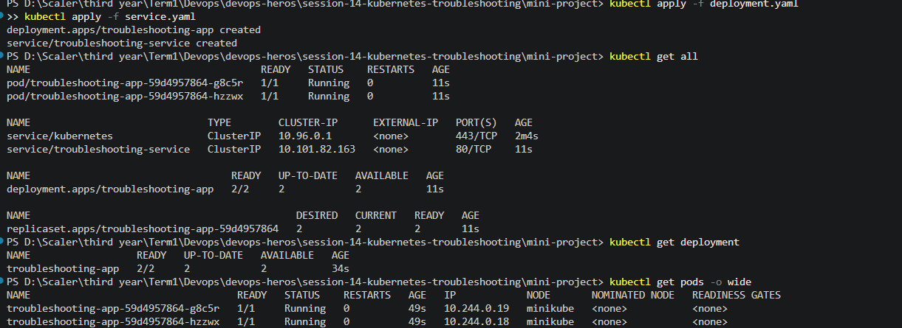
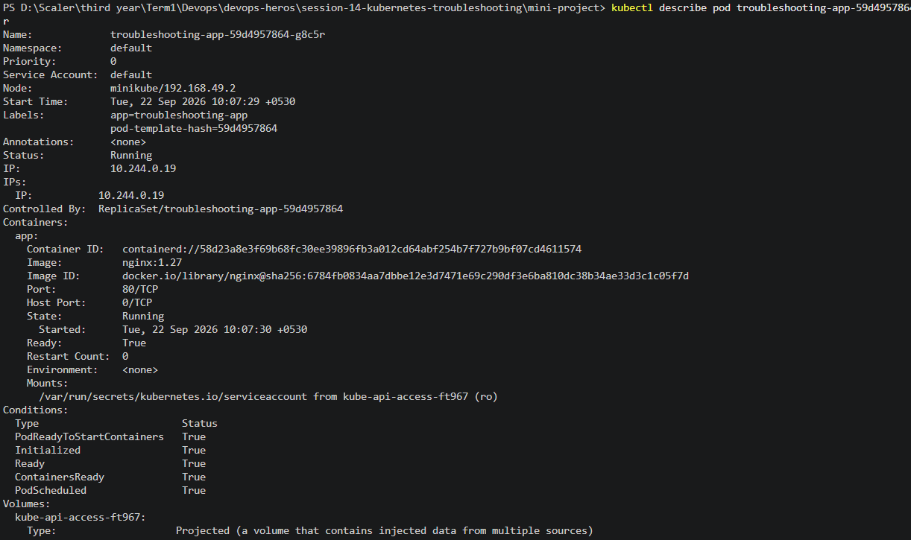
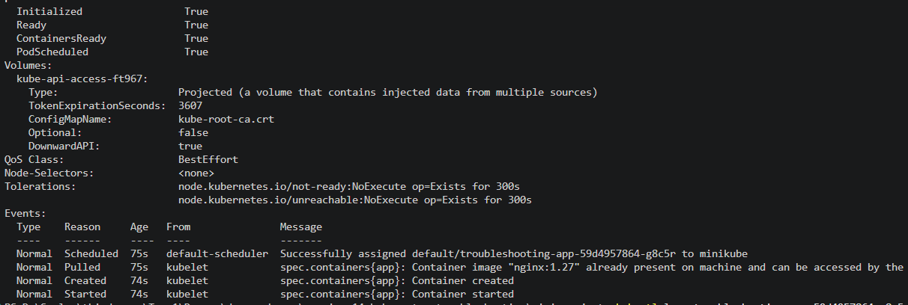
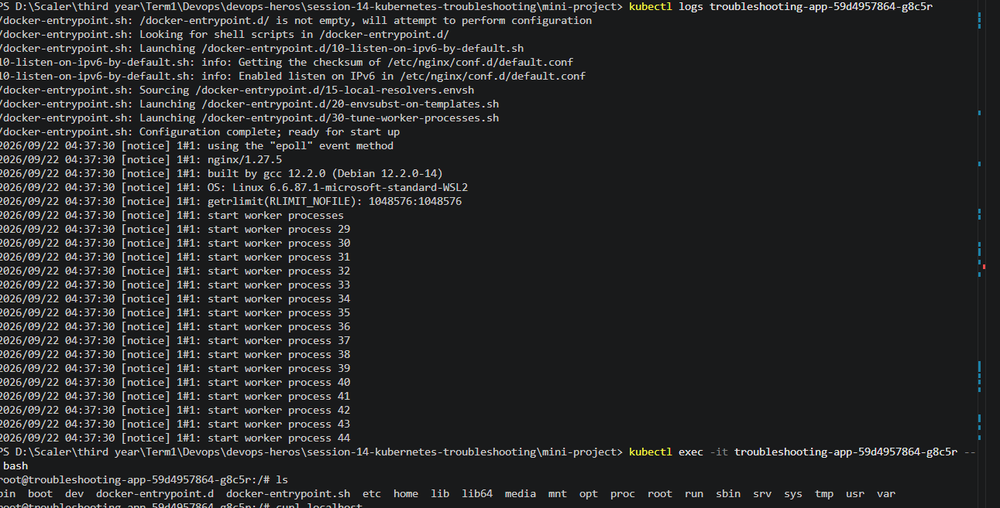
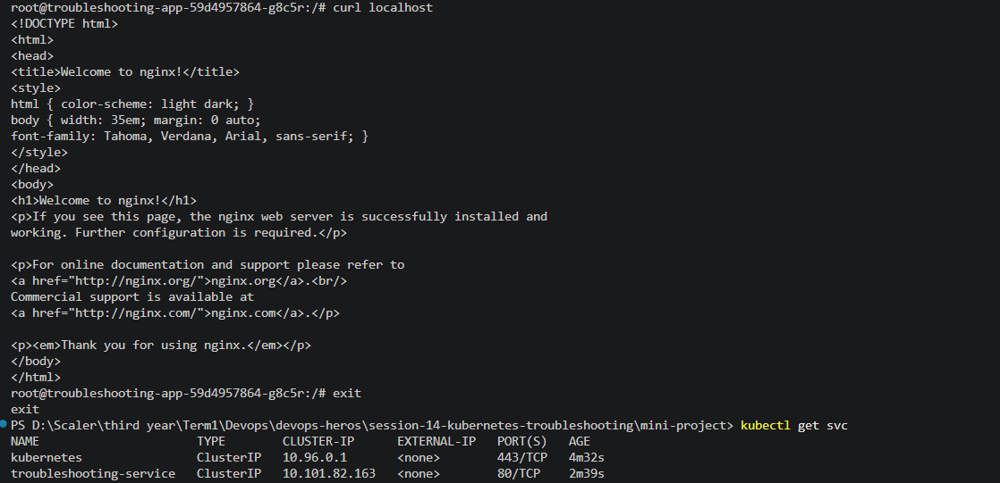
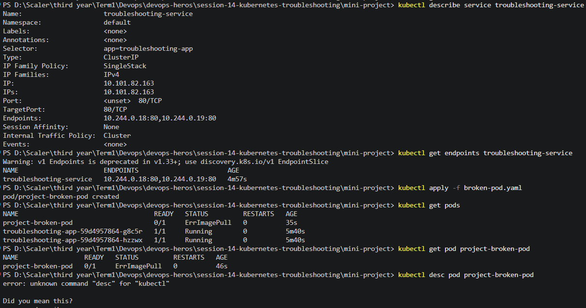
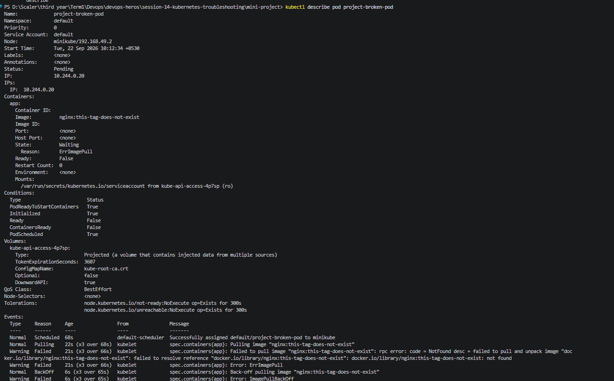
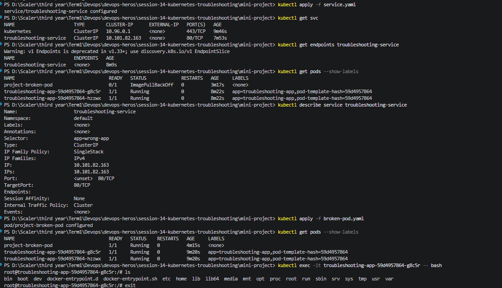
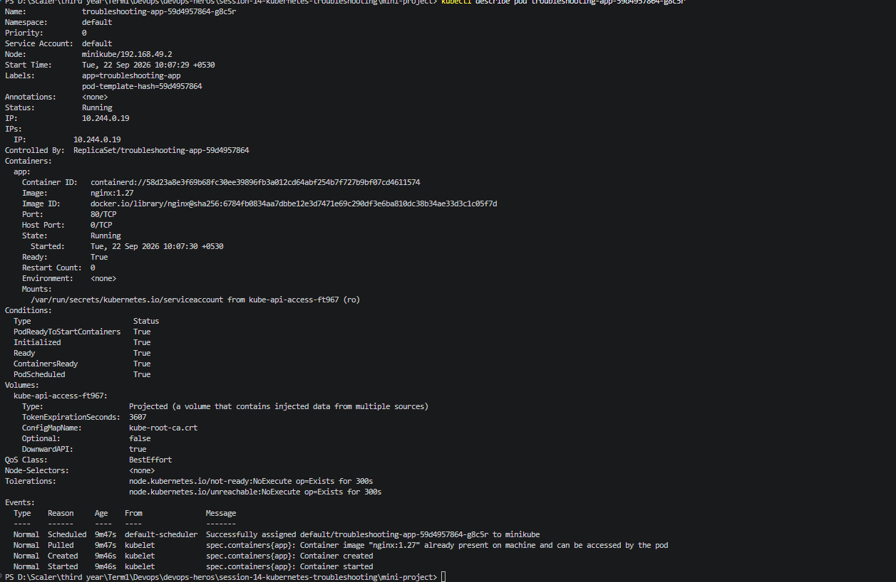