# aws configure
<!-- 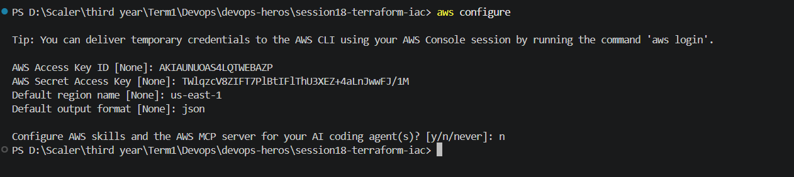 -->

# terraform init:
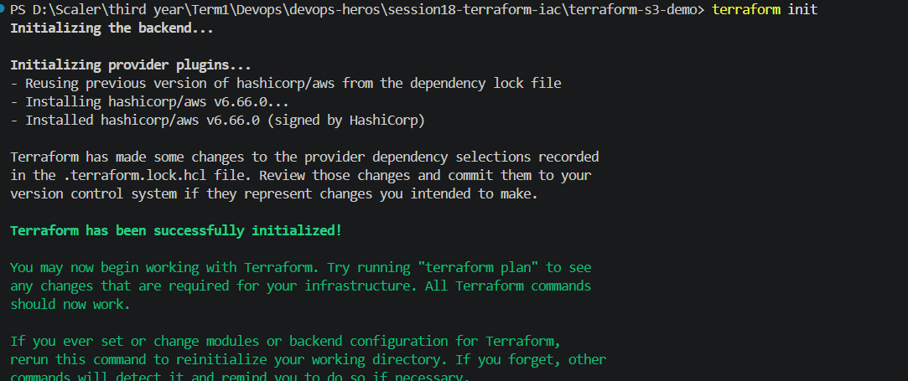

# ls -Force
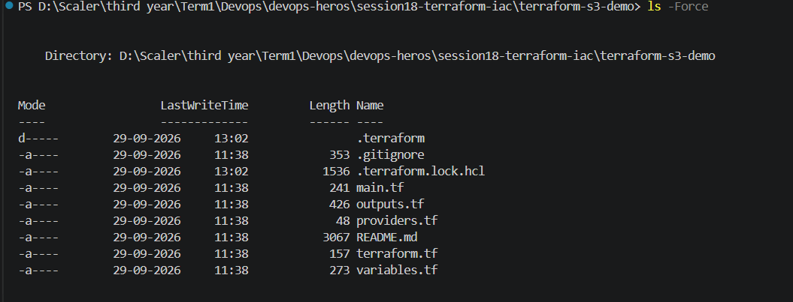

# terraform fmt
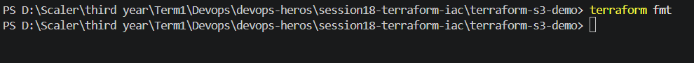

# terraform validate 
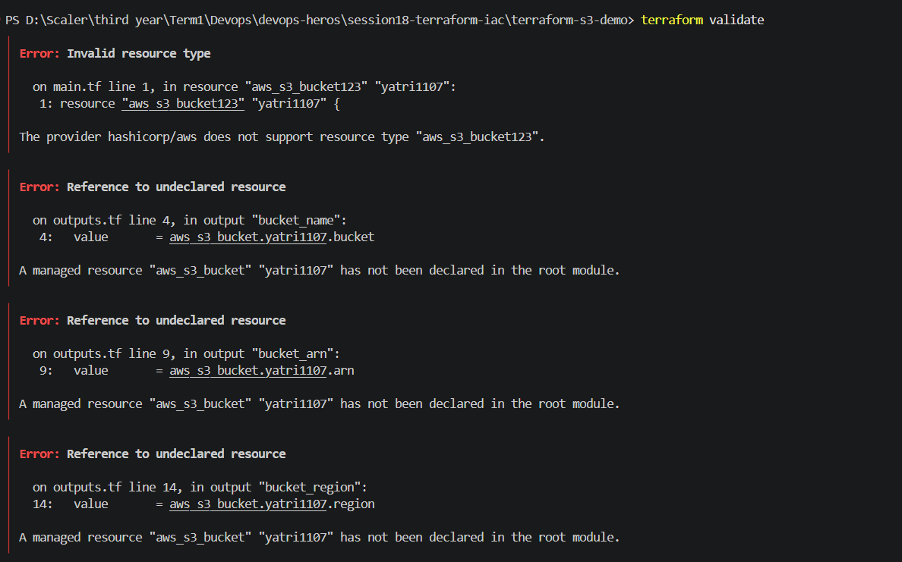
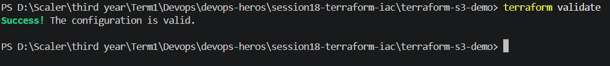

# terraform plan 
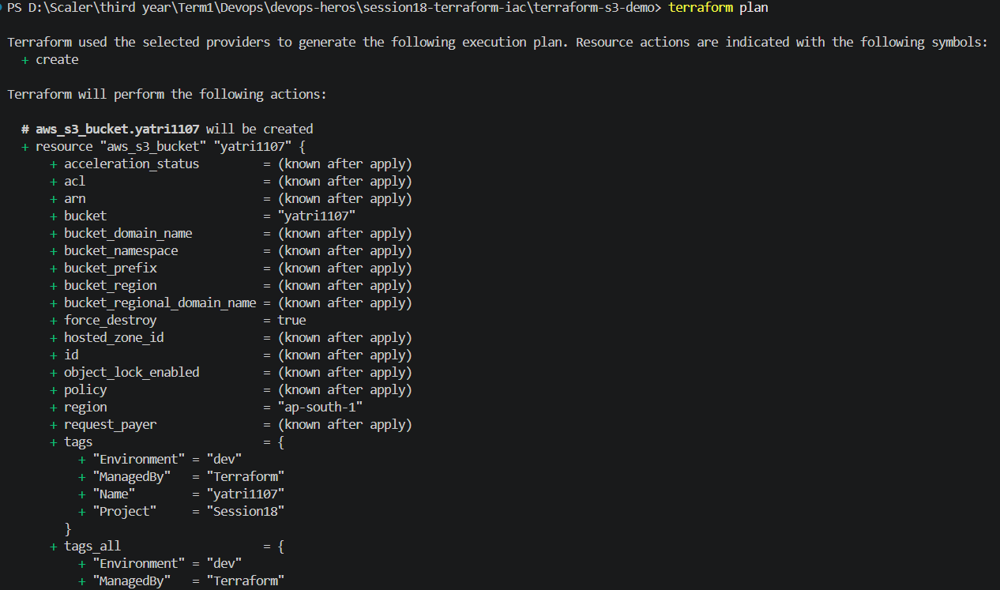
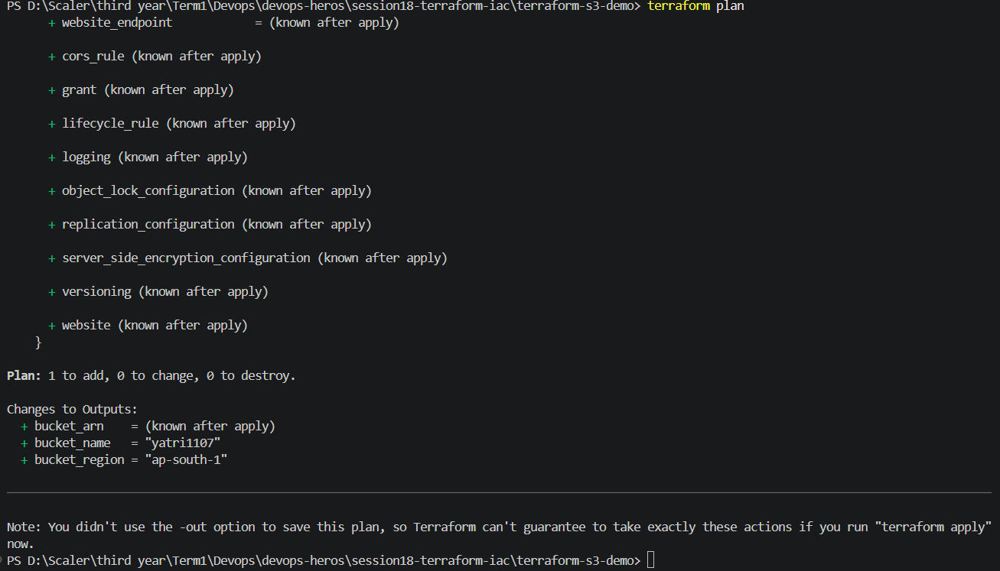

# terraform apply :
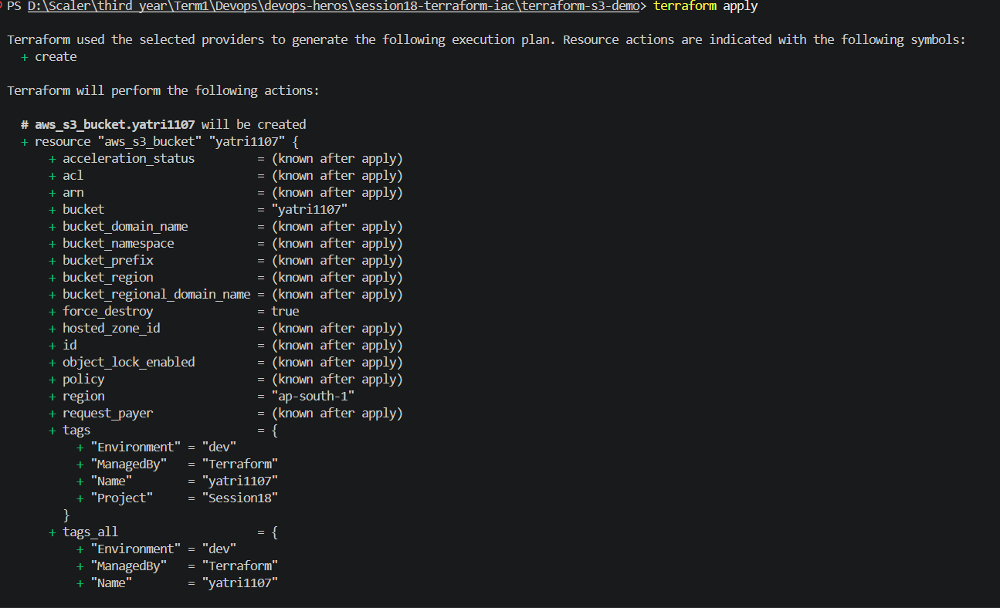
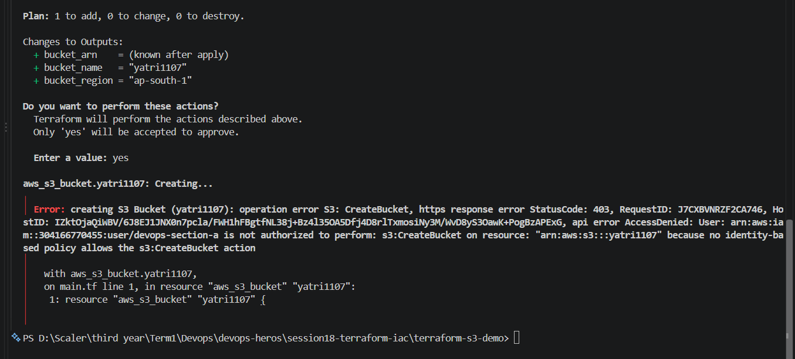
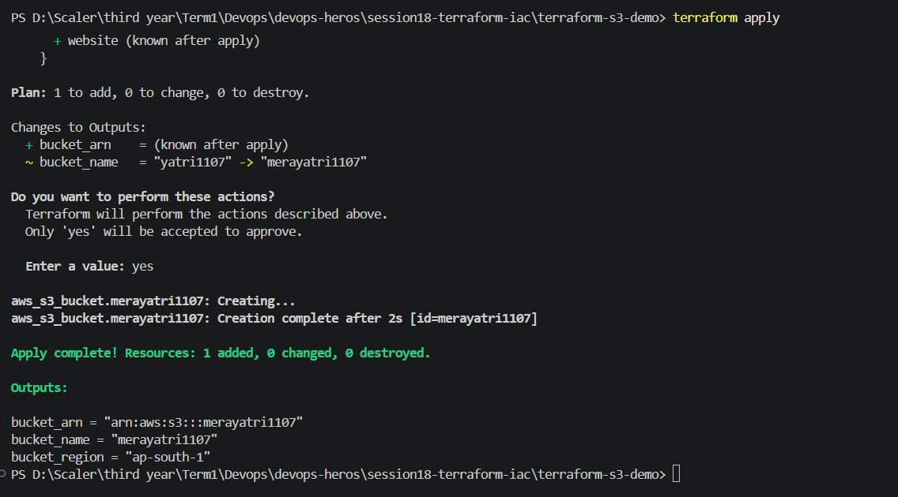

# terraform output
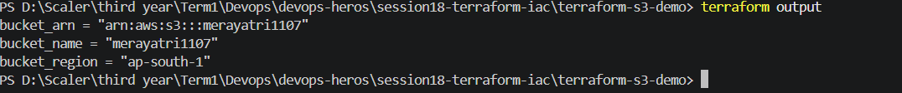

# terraform statelist
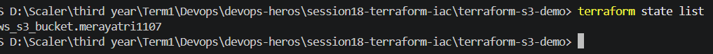

# terraform plan -destroy
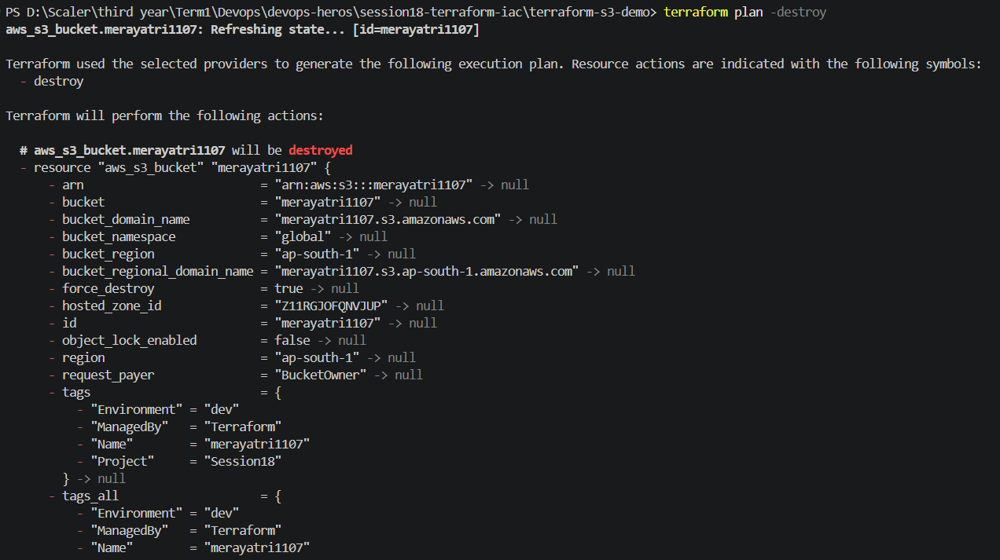
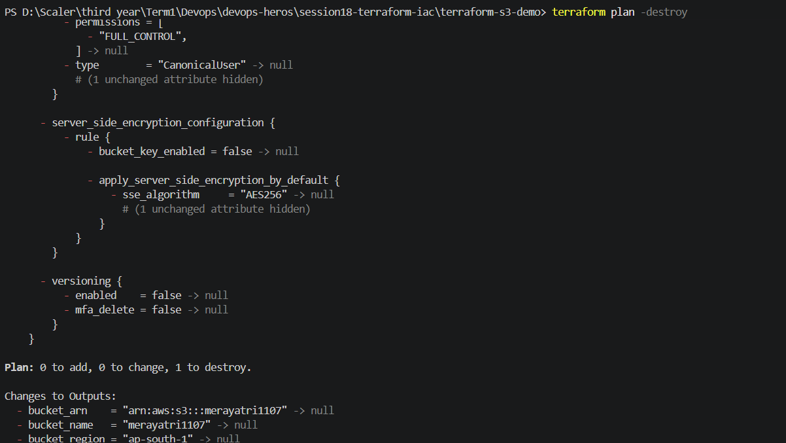
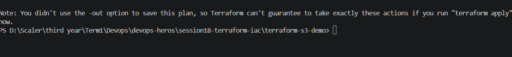

# terraform destroy :
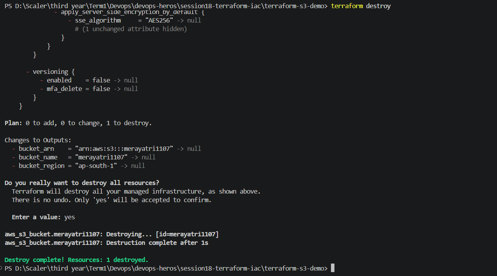